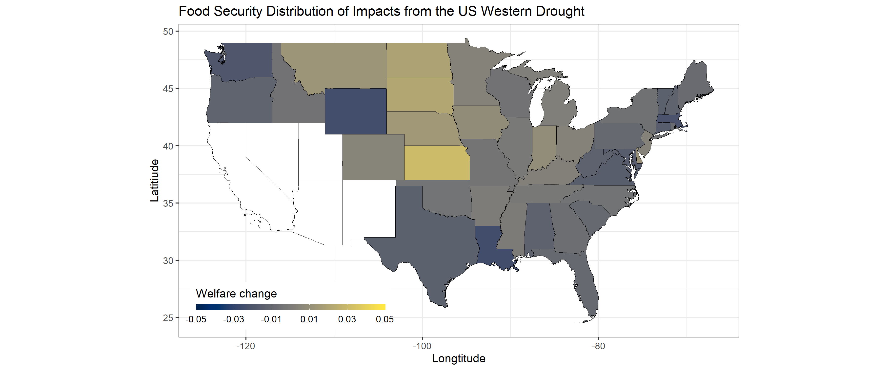

# What is the distributional effect of the Western drought in U.S. food security?

**Description**: This repository performs a general equilibrium welfare analysis derived from a gravity model of domestic and international food flows between all U.S. states. Then, it describes the results from a counterfactual that emulates a drought affecting the Western part of the US.

**Counterfactual results**: A simulation creates a counterfactual that decreases by 20% the agricultural productivity in Arizona, California, Nevada, New Mexico and Utah to emulate a the Western drought event. I find that most U.S. states will be affected by the the decrease in agricultural productivity, but with significant heterogeneity likely derived from the U.S. state's ability to substitute food imports for own production (Dall'Erba, Chen, Nava 2021) or the states reliance on food imports from these states (Nava, Ridley and Dall'Erba submitted in AJAE). The average welfare loss is 4% with the largest losses for the states impacted. I find a 3% reduction in wages in the U.S. The largest wage losses are associated with the states impacted by the drought.  Moreover, a handful of U.S. states benefit Western drought, suggesting that some U.S. food producers can gain market share. The picture below shows my counterfactual results excluding the states impacted by the drought (shown in white).

**Further consideration and caveats**: Counterfactual results from this analysis rely on assumptions and simplifications to prioritize the timely study of the effects of the temporary closure of the Western drought. In addition, little consideration is done to the magnitude of the effect. An appropriate analysis should consider the magnitude. Despite its limitations, counterfactual results are informative about the welfare distributions of the simulations. For example, not only there is significant heterogeneity in welfare losses.

The author is open to collaborations and suggestions.

All mistakes are my own.

**References:**

Baier, Yotov, and Zylkin .2019. *On the Widely Differing Effects of Free Trade Agreements: Lessons from Twenty Years of Trade Integration*, **Journal of International Economics** 116: 206-226.

Dall'Erba Sandy, Chen Zhangliang, Nava Noé J. 2021. *U.S. interstate trade will mitigate the negative impact of climate change on crop profit*, **American Journal of Agricultural Economics** 00(00): 1-22.

Nava Noé J, Ridley Bill, Dall'Erba Sandy. *Who benefits from local agriculture?*, submitted for publication consideration in the **American Journal of Agricultural Economics**

**Suggested citation**

Nava Noé J, Ridley Bill, Dall'Erba Sandy. *Who benefits from local agriculture?*, submitted for publication consideration in the **American Journal of Agricultural Economics**

